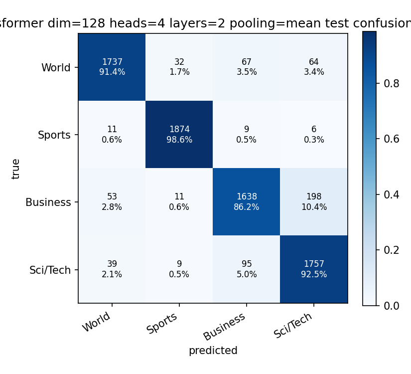
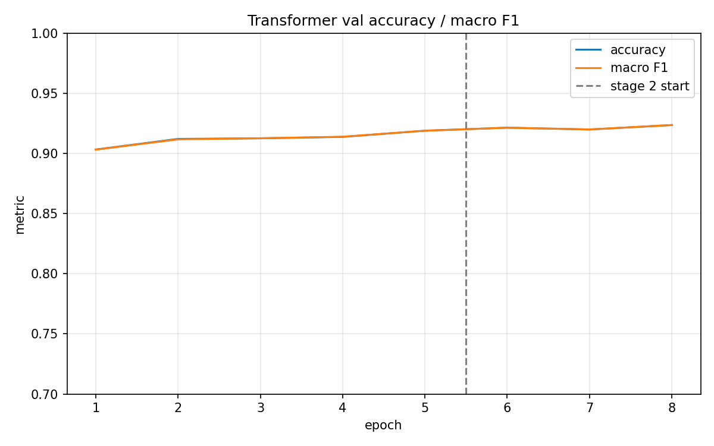
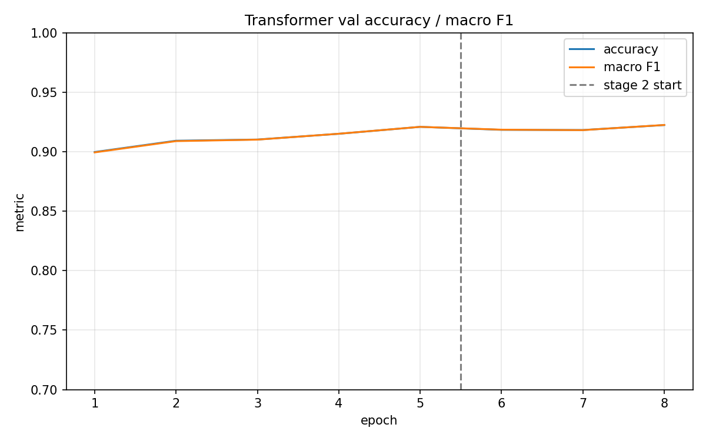
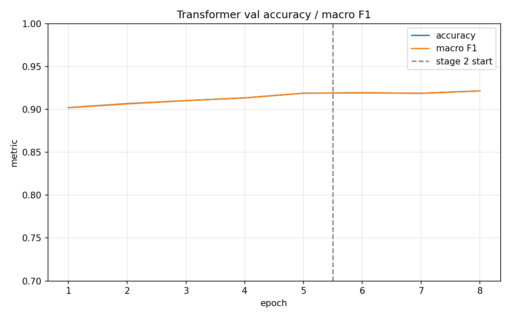
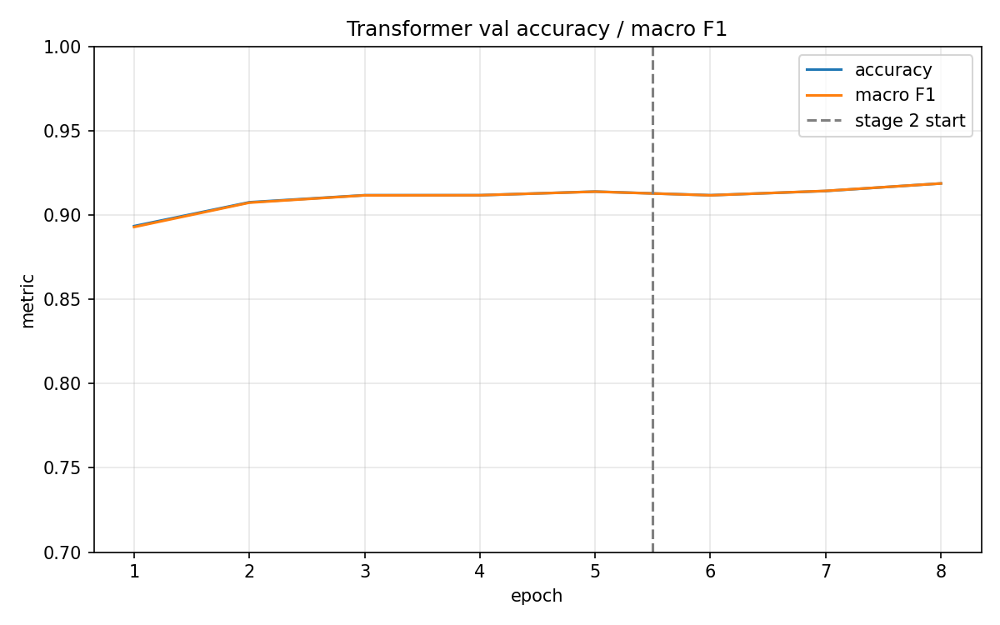
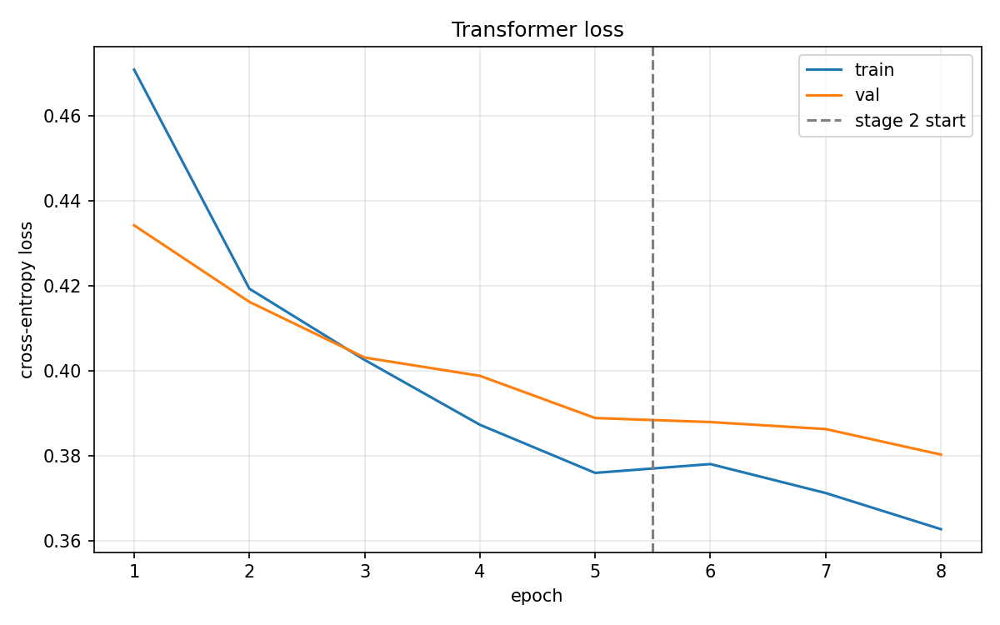
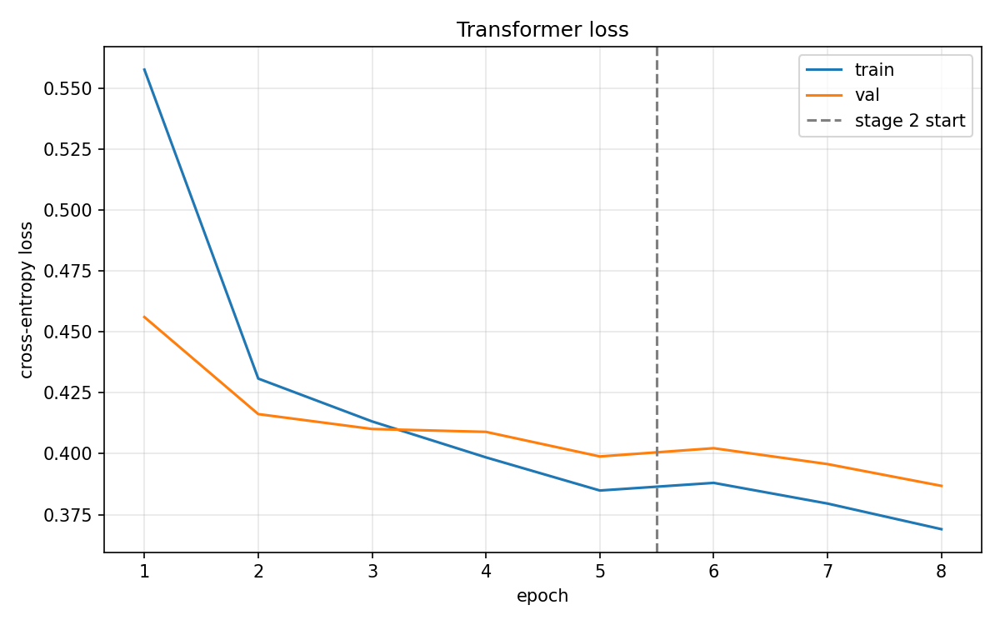

# AG News：RNN 与手写 Transformer 文本分类实验

## 1. 所有模型与对照实验的性能汇总

**8 组实验的 test 结果已全部补齐。** 下表直接比较三个 RNN，以及 Transformer 的
last / mean pooling、仅加宽、仅加深、同时加宽加深实验。Acc 与 Macro F1 均以百分数表示，越高越好。

| 模型 / 实验 | 宽度 × 层数 | Pooling | Val Acc | Val Macro F1 | Test Acc | Test Macro F1 | 总参数量 | 秒/epoch |
|---|---|---|---:|---:|---:|---:|---:|---:|
| R1 BiRNN | 256/方向 × 2 | last | 88.60% | 88.57% | 88.76% | 88.74% | 5.14M | 28.61 |
| R2 BiGRU | 256/方向 × 2 | last | 92.32% | 92.33% | 91.92% | 91.92% | 6.30M | 32.00 |
| R3 BiLSTM | 256/方向 × 2 | last | 92.05% | 92.04% | 91.86% | 91.84% | 6.87M | 29.58 |
| T0 Transformer（last 基线） | 128 × 2 | last | 91.97% | 91.96% | 92.04% | 92.03% | 4.97M | 6.89 |
| T1 Transformer（mean 基线） | 128 × 2 | mean | **92.37%** | **92.37%** | 92.18% | 92.18% | 4.97M | 6.69 |
| T2 Transformer（仅加宽） | 256 × 2 | mean | 92.25% | 92.26% | **92.47%** | **92.47%** | 6.17M | 10.16 |
| T3 Transformer（仅加深） | 128 × 4 | mean | 92.17% | 92.17% | 92.34% | 92.33% | 5.37M | 10.16 |
| T4 Transformer（加宽+加深） | 256 × 4 | mean | 91.88% | 91.88% | 92.04% | 92.03% | 7.75M | 18.86 |

**共同条件：** GloVe 100d、训练 batch=128、eval batch=256、5+3=8 个 epoch、
seed=42、MAX_LEN=128；优化器与两阶段学习率一致。RNN 均为双向，256 是每个方向的
hidden size（拼接后为 512）；所有 Transformer 均为 4 头。RNN dropout=0.5，
Transformer dropout=0.1，因此跨架构比较不是严格等容量、等正则化对照。

**直接看结论：** T1（128×2 mean）的验证成绩最高；T2（256×2 mean）的 test 成绩最高。
Mean 相比同尺寸 last 的 test accuracy 提高约 **0.14 个百分点**（多正确 11 篇）；
单独加宽、加深比 mean 基线分别多正确 22、12 篇，同时加宽加深则少正确 11 篇。
这些都是单 seed 的观察，尚未验证稳定性。

本项目是词级 GloVe + encoder + pooling + linear 分类器，不是 BERT 微调。
除词向量外，encoder 与分类头均从随机参数开始训练。

**结果口径与来源：**

- 截至 **2026-09-06**，共 8 组训练、8 组 test 记录。原始 T0 缺失的 test 已通过
  `python eval.py --weights outputs_transformer/best.pt --split test --save-cm`
  实际补跑，使用其日志恢复的 **128 维、2 层、4 头、last pooling** 配置，没有重新训练。
  [T0 评估文本](outputs_transformer/eval_test.txt) · [T0 test 矩阵](outputs_transformer/confusion_matrix_test.png)。
- Val 来自各 `training_log.json` 的 `meta.final_val`，对应最佳 checkpoint；
  Test 来自各自最佳 checkpoint 的 7,600 篇评估结果，每类 1,900 篇。
  其余七组复用已有 test 矩阵，不重复运行。全部来源见第 9 节。
- `best.pt` 仅在 val accuracy 严格提高时更新：R2 最佳为 epoch 7，T0 为 epoch 6，
  其余为 epoch 8。T0 第 8 轮准确率追平第 6 轮，不替换已保存权重。
- 总参数量含 embedding，根据模型结构计算；秒/epoch 是日志中的训练+验证耗时均值，
  不含准备、保存等开销，且不是同负载硬件 benchmark。详细结构和计数见第 2、5 节。
- 本节指标以百分数显示；后文分析表保留原日志的 0–1 记法，例如 **92.04% = 0.9204**。

## 2. 每个实验的模型配置与 pooling

所有实验共享 `Embedding(45618, 100)`，初始化使用 GloVe 6B.100d，
最大输入长度为 128 个 token，输出都是 `logits [B, 4]`。

| 编号 | Encoder 类型与宽度 | 层数 | 头数 / 每头维度 | FFN | Pooling | 分类头 Linear | Dropout |
|---|---|---:|---|---|---|---|---:|
| R1 | rnn，hidden=256/方向，双向 | 2 | — | — | `last` | 512→4 | 0.5 |
| R2 | gru，hidden=256/方向，双向 | 2 | — | — | `last` | 512→4 | 0.5 |
| R3 | lstm，hidden=256/方向，双向 | 2 | — | — | `last` | 512→4 | 0.5 |
| T0 | Transformer，dim=128 | 2 | 4 / 32 | 128→512→128 | `last` | 128→4 | 0.1 |
| T1 | Transformer，dim=128 | 2 | 4 / 32 | 128→512→128 | `mean` | 128→4 | 0.1 |
| T2 | Transformer，dim=256 | 2 | 4 / 64 | 256→1024→256 | `mean` | 256→4 | 0.1 |
| T3 | Transformer，dim=128 | 4 | 4 / 32 | 128→512→128 | `mean` | 128→4 | 0.1 |
| T4 | Transformer，dim=256 | 4 | 4 / 64 | 256→1024→256 | `mean` | 256→4 | 0.1 |

这里 RNN 的 `hidden_size=256` 是**每个方向**的宽度，双向拼接后为 512；
Transformer 的 `dim=128/256` 是所有头拼接后的总宽度，不能直接与 RNN 的单方向 hidden size 等同。

### RNN 路径

```text
ids [B, L]
  -> GloVe embedding + dropout [B, L, 100]
  -> 2-layer bidirectional RNN / GRU / LSTM
     outputs [B, L, 512], final [B, 512]
  -> last pooling -> dropout -> Linear(512, 4)
  -> logits [B, 4]
```

使用 packing 跳过 PAD 的循环计算。`last` 取最顶层正向终态与反向终态的拼接；
LSTM 使用 `h_n`，不是 `c_n`。它不等于 `outputs[:, -1]`，
也不等于最后一个有效位置上的完整双向输出。

RNN 的 dropout=0.5 用于 embedding 输出、两层 RNN 之间和分类头前。
Vanilla RNN 使用 tanh。

### Transformer 路径

```text
ids [B, L]
  -> GloVe embedding [B, L, 100]
  -> Linear(100, dim) + fixed sinusoidal positions + dropout
  -> N hand-written Post-LN Transformer layers [B, L, dim]
  -> last / masked mean pooling [B, dim]
  -> dropout -> Linear(dim, 4)
  -> logits [B, 4]
```

实现来自 [transformer_naive.py](model_transformer/transformer_naive.py)，
没有替换成 `nn.TransformerEncoder`。每层包含：

- 多头自注意力：Q/K/V 投影、按 `sqrt(head_dim)` 缩放、softmax、attention dropout、
  多头拼接与输出投影。
- Attention 残差分支：`LayerNorm(X + Dropout(MHA(X)))`。
- FFN：`Linear(dim, 4*dim) -> GELU -> Dropout -> Linear(4*dim, dim)`，
  再经过残差 dropout、相加与 LayerNorm；LayerNorm 后不额外加 GELU。

线性层都带 bias，LayerNorm 有可训练仿射参数；正弦/余弦位置编码是固定 buffer。
Dropout=0.1 用于投影加位置编码后、attention 权重、两条残差分支、FFN 内部和分类头前。
Transformer 复用的 `TokenEmbedding` 自身 dropout=0，避免输入处重复应用。

Attention 不使用 causal mask，真实 token 可以关注整篇文档。
`padding_mask=True` 表示 PAD，屏蔽的是 key 列；encoder 最后清零 PAD 位置输出。

### 两种已测试的 pooling

| 方法 | RNN | Transformer |
|---|---|---|
| `last` | 最顶层双向最终隐藏状态拼接 | 每篇文档最后一个真实 token 的输出，按 `lengths - 1` 索引 |
| `mean` | 代码支持，本轮未做 RNN 对照 | 所有真实 token 特征的逐维平均，排除 PAD，除以真实长度 |

T0 与 T1 唯一改变的模型配置是 `last -> mean`，pooling 本身不增加参数。
Transformer 没有 CLS token。代码也支持 masked `max`，但本次没有对应实验记录。

## 3. 数据与共同训练协议

### 数据划分及预处理

原始 CSV 为无表头的 `label, title, description`；
输入拼接为 `title + ". " + description`，标签从 1–4 转为 0–3，
顺序为 **World / Sports / Business / Sci/Tech**。

| 划分 | 文档数 | 每类文档数 | 用途 |
|---|---:|---:|---|
| Train | 114,000 | 28,500 | 梯度更新、建立词表 |
| Val | 6,000 | 1,500 | 每轮验证、选择 checkpoint 与比较配置 |
| Test | 7,600 | 1,900 | 使用已选 checkpoint 做最终评估 |

Val 是从原始 120,000 条 train 中分层切出的 5%，切分 seed 固定为 1234，
与训练 seed 42 分开。`train.py` 不使用 test 选择 checkpoint。

[dataset/ag_news.py](dataset/ag_news.py) 处理字面反斜杠换行、残缺 HTML 实体（如 `#39;`）
及 HTML 标签；分词器负责小写化，没有停用词过滤或词干还原。
词表只从 Train 建立，`min_freq=2`，共 **45,618** 个词项；
八份 `vocab.json` 的 SHA-256 一致，词与 ID 的映射相同。

长文档保留前 128 个 token，短文档在 collate 时补到**当前 batch 的最长长度**，
所以实际 `L <= 128`，不同 batch 的 L 可以不同。空序列以一个 UNK 兜底，
`PAD_IDX=0`、`UNK_IDX=1`。

八份日志均记录 GloVe 词表覆盖率 **89.95%（type）**，Val UNK 比例 **0.91%（token）**。
这两个比例统计对象不同，不能互相取补数。在词表内但未命中 GloVe 的普通词保留自己的 ID，
初始化为均值 0、标准差 0.1 的随机向量，Stage 2 解冻后可以学习；词表外的词映射到 UNK。

> 既有数据自检记录：清洗后 Train 文档长度均值约 45.6、中位数 44、P99 为 97，
> 128-token 截断影响 411 / 114,000（约 0.36%）篇。此前还发现一篇相同文档同时落入
> Train 与 Val，来自原始语料的重复，现有实验未去重。本次没有重跑这些语料统计，
> 保留此说明作为数据限制，而不是声称划分在文档内容上绝对无重叠。

### 所有实验共同使用的超参数

| 项目 | 设置 |
|---|---|
| 训练 / 验证与测试 batch size | 128 / 256 |
| 每轮训练 batch 数 | 891，`drop_last=False` |
| 训练 seed / 划分 seed | 42 / 1234 |
| DataLoader workers | 0 |
| 设备 | 日志均为 `cuda` |
| Optimizer | Adam，weight decay = 1e-4 |
| Loss | CrossEntropyLoss，label smoothing = 0.05 |
| 梯度裁剪 | 全局梯度范数上限 5 |
| 训练预算 | Stage 1：5 轮；Stage 2：3 轮；共 8 轮 |
| 调度 | 每阶段独立创建 CosineAnnealingLR，无 warmup |
| Checkpoint 选择 | 全部 8 轮中 val accuracy 最高者；相同准确率保留较早者 |

**RNN 与 Transformer 的 batch size、学习率、训练轮数相同；dropout 不同。**

| 阶段 | Embedding | Encoder 初始 LR | Head 初始 LR | Embedding 初始 LR |
|---|---|---:|---:|---:|
| Stage 1，epoch 1–5 | 冻结 | 1e-3 | 1e-3 | 不加入 optimizer |
| Stage 2，epoch 6–8 | 解冻 | 3e-4 | 3e-4 | 5e-5 |

表中 LR 是各阶段起点，随后按 cosine 下降；Stage 2 重建 optimizer 和 scheduler。
这里的 `train_loss` / `val_loss` 都是按样本数加权平均的交叉熵，不是整轮损失总和。

## 4. 对照实验分析

### 4.1 Pooling：last 与 mean

保持 `dim=128、layers=2、heads=4、dropout=0.1` 和全部训练设置不变：

| Pooling | Best Val Acc | Best Val Macro F1 | 最佳 epoch | Test Acc |
|---|---:|---:|---:|---:|
| T0 last | 0.9197 | 0.9196 | 6 | 0.9204 |
| T1 mean | 0.9237 | 0.9237 | 8 | 0.9218 |

Mean 的最佳 val accuracy 提高 **0.40 个百分点（24 / 6,000 篇）**，因此当前
`config.TRANSFORMER_POOLING = "mean"`。这支持在本项目中以 mean 作为默认配置，
补齐 T0 的 test 后，mean 的 test accuracy 从 0.9204 提高到 0.9218，
增加约 **0.14 个百分点（11 / 7,600 篇）**。只有单 seed，尚不能证明稳定优势。
旧目录 `outputs_transformer/` 的结果仍属于 **last**，没有改用 mean 重新评估。

### 4.2 宽度 × 深度：四组 mean pooling 对照

头数固定为 4，FFN 宽度固定为 `4*dim`；其余训练配置一致。
因此加宽会同时改变每头维度（32→64）和 FFN 中间宽度（512→1024）。
下表差值均相对于 T1；“非 embedding 参数”就是 encoder + head。

| 配置（dim×层数） | Val Acc | Δ Val（百分点） | Test Acc | Δ Test（百分点） | Test 多正确篇数 | 非 embedding 参数倍率 | 耗时倍率 |
|---|---:|---:|---:|---:|---:|---:|---:|
| T1 128×2 | 0.9237 | +0.00 | 0.9218 | +0.00 | +0 | 1.00× | 1.00× |
| T2 256×2 | 0.9225 | -0.12 | 0.9247 | +0.29 | +22 | 3.92× | 1.52× |
| T3 128×4 | 0.9217 | -0.20 | 0.9234 | +0.16 | +12 | 1.97× | 1.52× |
| T4 256×4 | 0.9188 | -0.48 | 0.9204 | -0.14 | -11 | 7.77× | 2.82× |

可以得出的结论：

1. **在固定 8 轮预算下，加大模型没有提高最佳验证成绩。** T1 的验证集正确数为
   5,542；T2/T3/T4 分别为 5,535 / 5,530 / 5,513。
2. **Test 上单独加宽或加深有小幅提升，但并非单调收益。** T2/T3 分别比 T1 多正确
   22 / 12 篇；T4 则少正确 11 篇，同时非 embedding 参数约为 7.77 倍、耗时约为 2.82 倍。
3. **Val 与 test 排序不一致。** 以 val 选择配置仍是 T1；T2 是本次已观察到的最高
   test 分数，不据此反向改选“最佳验证模型”或默认配置。继续据 test 调参会削弱其独立评估意义。
4. 这些结果只回答“在同一套超参数和预算下放大是否有收益”，不回答更大模型充分调优后的上限。
   尤其 T4 的训练 loss 也未低于 T1，不能仅凭 test 较低就断言是过拟合；
   更长预算、学习率、warmup 或正则化是否有帮助仍需独立对照。

### 4.3 RNN cell 与跨架构比较

R1/R2/R3 保持相同的 hidden size、层数、双向设置、pooling 和 dropout，只换 cell，
但门数不同，因此参数量不是相等的。

- GRU 比 vanilla RNN 的 test accuracy 高 **3.16 个百分点**，错误从 854 降到 614，
  少错 240 篇（错误数减少 28.1%）。
- GRU 与 LSTM 分别为 0.9192 / 0.9186，仅差 **5 / 7,600 篇**。
  单次运行不足以建立稳定的 GRU > LSTM 排序。
- T1/T2 的 test accuracy 分别比 GRU 高 **0.26 / 0.55 个百分点**。
  但 Transformer 同时改变了输出宽度、pooling、dropout 和参数预算，
  不能把全部差距单独归因于 attention。
- 本次门控 RNN 的第一轮 val accuracy 已超过 vanilla RNN 的第 8 轮，
  显示当前配置下的收敛差异；这不是对所有训练预算的普遍结论。

### 4.4 收敛与冻结 / 解冻阶段

下表的 epoch 8 指标是**最后一轮**，与主结果表的最佳 checkpoint 分开记录。

| 编号 | Epoch 1 Val Acc | Epoch 5 Val Acc | Epoch 8 Val Acc | Epoch 8 Train loss | Epoch 8 Val loss |
|---|---:|---:|---:|---:|---:|
| R1 | 0.8153 | 0.8807 | 0.8860 | 0.5176 | 0.4700 |
| R2 | 0.8955 | 0.9185 | 0.9225 | 0.3995 | 0.3824 |
| R3 | 0.8968 | 0.9177 | 0.9205 | 0.3974 | 0.3848 |
| T0 | 0.8985 | 0.9178 | 0.9197 | 0.3688 | 0.3862 |
| T1 | 0.9033 | 0.9190 | 0.9237 | 0.3628 | 0.3803 |
| T2 | 0.8998 | 0.9210 | 0.9225 | 0.3550 | 0.3747 |
| T3 | 0.9022 | 0.9190 | 0.9217 | 0.3627 | 0.3784 |
| T4 | 0.8935 | 0.9140 | 0.9188 | 0.3690 | 0.3868 |

八组实验的最佳 checkpoint 都出现在 Stage 2。但 Stage 2 同时增加训练轮数、
解冻 embedding，并重建 optimizer / scheduler，不能把全部提升归因于“解冻有效”；
还缺少继续冻结并训练同样轮数的对照。

训练 loss 在 dropout 开启且参数持续更新时累计；验证 loss 在轮末 eval 模式下计算。
二者条件不同，不能只看 train loss 大于或小于 val loss 就判断欠拟合 / 过拟合。

## 5. 参数量与耗时

按各日志的实际维度和当前模型结构逐项计算，包含 bias 与 LayerNorm 参数；
不是重新实例化模型或运行 benchmark 得到的测量。
所有实验的 embedding 参数均为 **4,561,800**，固定位置编码不计入参数量。

| 编号 | Encoder 参数 | Head 参数 | Stage 1 可训练参数 | 总参数 / Stage 2 参数 | 平均秒/epoch | 8 轮秒数之和 |
|---|---:|---:|---:|---:|---:|---:|
| R1 | 577,536 | 2,052 | 579,588 | 5,141,388 | 28.61 | 228.9 |
| R2 | 1,732,608 | 2,052 | 1,734,660 | 6,296,460 | 32.00 | 256.0 |
| R3 | 2,310,144 | 2,052 | 2,312,196 | 6,873,996 | 29.58 | 236.6 |
| T0 | 409,472 | 516 | 409,988 | 4,971,788 | 6.89 | 55.1 |
| T1 | 409,472 | 516 | 409,988 | 4,971,788 | 6.69 | 53.5 |
| T2 | 1,605,376 | 1,028 | 1,606,404 | 6,168,204 | 10.16 | 81.3 |
| T3 | 806,016 | 516 | 806,532 | 5,368,332 | 10.16 | 81.3 |
| T4 | 3,184,896 | 1,028 | 3,185,924 | 7,747,724 | 18.86 | 150.9 |

Stage 1 只冻结 embedding，所以可训练参数 = encoder + head；Stage 2 解冻全部。
Embedding 的 PAD 行虽然计入张量参数量，但不会通过 embedding 查表收到普通 token 的梯度。

Transformer 的 encoder 包含输入投影和 N 个 layer：

```text
输入投影参数 = 100 * dim + dim
每层参数     = 12 * dim^2 + 13 * dim
分类头参数   = 4 * dim + 4
总参数       = 4,561,800 + 输入投影参数 + N * 每层参数 + 分类头参数
```

只看含 embedding 的总参数会掩盖规模差异：T1→T4 的总参数约从 4.97M 到 7.75M，
但真正随机初始化的 encoder + head 从约 0.41M 到 3.19M。

耗时来自 `history[].time_sec`，包含每轮训练与验证，不包含数据/GloVe 准备、
checkpoint 保存和训练后的绘图/最终报告，不等于整个进程墙钟时间。
RNN 记录来自 09-03，Transformer 来自 09-06；日志未保存 GPU 型号和运行负载。

本次记录里 T1 平均 **6.69 s/epoch**，三个 RNN 平均 **28.61–32.00 s/epoch**，
约为 T1 的 **4.28–4.79 倍**。这只是这些完整配置的耗时对比，不是等容量、同负载硬件基准；
不能仅凭这些数字断言某个 kernel 是瓶颈，或“cuDNN 把不同 cell 的计算差异抹平了”。

## 6. Test 分类表现与错误分析

每类 support 均为 1,900。以下由已保存 test 混淆矩阵重新计算；
F1 为 `2 * precision * recall / (precision + recall)`，
Macro F1 是四类 F1 的平均值，不是先平均 precision/recall 再求 F1。

| 编号 | World F1 | Sports F1 | Business F1 | Sci/Tech F1 | 总错误篇数 | Business ↔ Sci/Tech 错误（占总错误） |
|---|---:|---:|---:|---:|---:|---:|
| R1 | 0.8915 | 0.9577 | 0.8405 | 0.8597 | 854 | 382（44.7%） |
| R2 | 0.9275 | 0.9756 | 0.8804 | 0.8933 | 614 | 292（47.6%） |
| R3 | 0.9261 | 0.9704 | 0.8824 | 0.8947 | 619 | 284（45.9%） |
| T0 | 0.9254 | 0.9765 | 0.8823 | 0.8972 | 605 | 288（47.6%） |
| T1 | 0.9289 | 0.9796 | 0.8833 | 0.8953 | 594 | 293（49.3%） |
| T2 | 0.9331 | 0.9801 | 0.8872 | 0.8985 | 572 | 282（49.3%） |
| T3 | 0.9307 | 0.9794 | 0.8860 | 0.8972 | 582 | 286（49.1%） |
| T4 | 0.9270 | 0.9793 | 0.8813 | 0.8935 | 605 | 298（49.3%） |

Business 与 Sci/Tech 的双向误判占 **44.7%–49.3%** 的总错误，是这些模型共同的主要错误来源。
以 T2 为例，Business→Sci/Tech 为 198 篇，反向为 84 篇，共 282 篇；
Sports F1 则达到 0.9801。主题重叠可能是原因之一，但需要检查具体文档，
不能仅凭混淆矩阵认定都是标签歧义。

T2 比 T1 总共少错 22 篇，其中 Business↔Sci/Tech 少错 11 篇，
并不是只改善这一对类别。

### 默认模型 T1 与最高 test 分数模型 T2 的逐类指标

| 编号 | 类别 | Precision | Recall | F1 | Support |
|---|---|---:|---:|---:|---:|
| T1 | World | 0.9440 | 0.9142 | 0.9289 | 1900 |
| T1 | Sports | 0.9730 | 0.9863 | 0.9796 | 1900 |
| T1 | Business | 0.9055 | 0.8621 | 0.8833 | 1900 |
| T1 | Sci/Tech | 0.8677 | 0.9247 | 0.8953 | 1900 |
| T2 | World | 0.9533 | 0.9137 | 0.9331 | 1900 |
| T2 | Sports | 0.9740 | 0.9863 | 0.9801 | 1900 |
| T2 | Business | 0.9080 | 0.8674 | 0.8872 | 1900 |
| T2 | Sci/Tech | 0.8676 | 0.9316 | 0.8985 | 1900 |

| T1：128×2 mean | T2：256×2 mean |
|---|---|
|  |  |

其他模型的 test 图和原始计数见第 9 节。所有图片中行是真实类别、列是预测类别。

## 7. 训练曲线

下图都来自已有训练产物；accuracy / macro F1 曲线是 **Val**，不是 test。
完整 loss 和 accuracy 图链接见第 9 节。

| T1：128×2 mean | T2：256×2 mean |
|---|---|
|  |  |
| T3：128×4 mean | T4：256×4 mean |
|  |  |

| T1 loss | T4 loss |
|---|---|
|  |  |

## 8. 运行与复现

在 AG-News 项目目录和原有 PyTorch 环境中执行：

```powershell
conda activate dev
cd C:\code\beatDL\text\1_text_classification\AG-News
```

### 8.1 训练全部八种配置

以下命令显式给出每组的架构、pooling 和 dropout，共用 seed、batch size 和轮数。
输出目录加 `_rerun` 后缀，以免覆盖本报告引用的历史实验；如已有同名重跑目录，
请再换一个新目录。

```powershell
$trainArgs = @('--batch-size', '128', '--seed', '42', '--num-workers', '0', '--epochs-stage1', '5', '--epochs-stage2', '3')

python train.py @trainArgs --model rnn --cell rnn --layers 2 --dropout 0.5 --pooling last --output-dir outputs_rnn_rerun
python train.py @trainArgs --model rnn --cell gru --layers 2 --dropout 0.5 --pooling last --output-dir outputs_gru_rerun
python train.py @trainArgs --model rnn --cell lstm --layers 2 --dropout 0.5 --pooling last --output-dir outputs_lstm_rerun
python train.py @trainArgs --model transformer --dim 128 --group 4 --layers 2 --dropout 0.1 --pooling last --output-dir outputs_transformer_rerun
python train.py @trainArgs --model transformer --dim 128 --group 4 --layers 2 --dropout 0.1 --pooling mean --output-dir outputs_transformer_mean_rerun
python train.py @trainArgs --model transformer --dim 256 --group 4 --layers 2 --dropout 0.1 --pooling mean --output-dir outputs_transformer_d256_l2_mean_rerun
python train.py @trainArgs --model transformer --dim 128 --group 4 --layers 4 --dropout 0.1 --pooling mean --output-dir outputs_transformer_d128_l4_mean_rerun
python train.py @trainArgs --model transformer --dim 256 --group 4 --layers 4 --dropout 0.1 --pooling mean --output-dir outputs_transformer_d256_l4_mean_rerun
```

这些命令仍依赖 [config.py](config.py) 中的 GloVe 100d、RNN hidden=256、
bidirectional=True、MAX_LEN=128、数据切分、优化器和学习率设置，复现时应与第 3 节一致。
当前 CLI 没有直接覆盖 RNN hidden size 或学习率的参数。

当前 `python train.py --model transformer` 默认是 **128 维、4 头、2 层、mean pooling**；
RNN 默认是 LSTM、last pooling。Transformer 的默认输出目录仍是 `outputs_transformer/`，
里面保存的是历史 **last** 基线，因此新训练务必显式指定 `--output-dir`。

原有 `run_all.ps1` 仅运行三个 RNN cell 的训练和 test，不包含 Transformer，
并且使用原始输出目录；不要在想保留现有结果时直接重跑它。

数据缺失时训练入口会下载 AG News；GloVe 优先复用同级 SST-2 项目已有文件，
不存在时才下载。本次八份日志均使用 SST-2 目录中的 `glove.6B.100d.txt`。

### 8.2 评估全部八组 test 模型

```powershell
python eval.py --weights outputs_rnn/best.pt --split test --save-cm
python eval.py --weights outputs_gru/best.pt --split test --save-cm
python eval.py --weights outputs_lstm/best.pt --split test --save-cm
python eval.py --weights outputs_transformer/best.pt --split test --save-cm
python eval.py --weights outputs_transformer_mean/best.pt --split test --save-cm
python eval.py --weights outputs_transformer_d256_l2_mean/best.pt --split test --save-cm
python eval.py --weights outputs_transformer_d128_l4_mean/best.pt --split test --save-cm
python eval.py --weights outputs_transformer_d256_l4_mean/best.pt --split test --save-cm
```

如需评估新训练的 `_rerun` 模型，将对应 weights 路径换成新目录。
评估会从同目录日志恢复 dim、层数、heads 和 pooling，
**无需在 eval 命令上再手动指定 mean，也不要为了改 pooling 而覆盖旧实验配置。**

原始 T0 的缺失 test 记录已在本次更新中用上述命令补齐，不需重训。
完整控制台结果另存于 [eval_test.txt](outputs_transformer/eval_test.txt)。

`--save-cm` 会保存或覆盖对应目录的 `confusion_matrix_test.png`。
当前 `eval.py` 把指标打印到控制台，不自动追加 test JSON，也不更新 `training_log.json`；
需要留存文本时可另存终端输出。不要把 `confusion_matrix.png`（val）当成 test。

### 8.3 预测与错误样本

```powershell
python predict/predict.py --weights outputs_transformer_mean/best.pt --text "Arsenal beat Chelsea 2-1"
python predict/predict.py --weights outputs_transformer_d256_l2_mean/best.pt --test-mistakes 30
```

请将 **best.pt、vocab.json、training_log.json 保存在同一个实验目录**。
Checkpoint 已包含训练后的 embedding，评估/预测无需重新载入 GloVe；
词表缺失时虽然代码尝试重建，但只有数据和相关配置保持一致才能保证 ID 对齐。

本次只实际执行了 T0 缺失的 test 评估；没有重新训练、运行预测或重复评估其余七组。

## 9. 产物索引与可核对的原始计数

| 编号 | 目录 | 配置与逐轮日志 | 训练曲线 | 验证矩阵 | 测试矩阵 |
|---|---|---|---|---|---|
| R1 | `outputs_rnn/` | [log](outputs_rnn/training_log.json) | [loss](outputs_rnn/loss_curve.png) · [acc/F1](outputs_rnn/acc_curve.png) | [val](outputs_rnn/confusion_matrix.png) | [test](outputs_rnn/confusion_matrix_test.png) |
| R2 | `outputs_gru/` | [log](outputs_gru/training_log.json) | [loss](outputs_gru/loss_curve.png) · [acc/F1](outputs_gru/acc_curve.png) | [val](outputs_gru/confusion_matrix.png) | [test](outputs_gru/confusion_matrix_test.png) |
| R3 | `outputs_lstm/` | [log](outputs_lstm/training_log.json) | [loss](outputs_lstm/loss_curve.png) · [acc/F1](outputs_lstm/acc_curve.png) | [val](outputs_lstm/confusion_matrix.png) | [test](outputs_lstm/confusion_matrix_test.png) |
| T0 | `outputs_transformer/` | [log](outputs_transformer/training_log.json) | [loss](outputs_transformer/loss_curve.png) · [acc/F1](outputs_transformer/acc_curve.png) | [val](outputs_transformer/confusion_matrix.png) | [test](outputs_transformer/confusion_matrix_test.png) |
| T1 | `outputs_transformer_mean/` | [log](outputs_transformer_mean/training_log.json) | [loss](outputs_transformer_mean/loss_curve.png) · [acc/F1](outputs_transformer_mean/acc_curve.png) | [val](outputs_transformer_mean/confusion_matrix.png) | [test](outputs_transformer_mean/confusion_matrix_test.png) |
| T2 | `outputs_transformer_d256_l2_mean/` | [log](outputs_transformer_d256_l2_mean/training_log.json) | [loss](outputs_transformer_d256_l2_mean/loss_curve.png) · [acc/F1](outputs_transformer_d256_l2_mean/acc_curve.png) | [val](outputs_transformer_d256_l2_mean/confusion_matrix.png) | [test](outputs_transformer_d256_l2_mean/confusion_matrix_test.png) |
| T3 | `outputs_transformer_d128_l4_mean/` | [log](outputs_transformer_d128_l4_mean/training_log.json) | [loss](outputs_transformer_d128_l4_mean/loss_curve.png) · [acc/F1](outputs_transformer_d128_l4_mean/acc_curve.png) | [val](outputs_transformer_d128_l4_mean/confusion_matrix.png) | [test](outputs_transformer_d128_l4_mean/confusion_matrix_test.png) |
| T4 | `outputs_transformer_d256_l4_mean/` | [log](outputs_transformer_d256_l4_mean/training_log.json) | [loss](outputs_transformer_d256_l4_mean/loss_curve.png) · [acc/F1](outputs_transformer_d256_l4_mean/acc_curve.png) | [val](outputs_transformer_d256_l4_mean/confusion_matrix.png) | [test](outputs_transformer_d256_l4_mean/confusion_matrix_test.png) |

每个目录另外保存 `best.pt` 与 `vocab.json`。
`training_log.json` 包含 `meta`（数据、模型、优化器、最佳轮次及最终 val 报告）
和 `history`（各轮 loss、val acc/F1、实际 LR、耗时）。

<details>
<summary>展开：八张 test 混淆矩阵的整数计数</summary>

顺序统一为 World / Sports / Business / Sci/Tech；每行是真实类别，每列是预测类别，
每行和为 1,900。Acc = 对角线之和 / 7,600。逐类 precision 用列和作分母，
recall 用行和作分母。T0 计数来自本次实际 eval 的控制台输出，并与新生成的 PNG 核对；
其余七组计数来自已有 PNG。

R1 — [outputs_rnn/confusion_matrix_test.png](outputs_rnn/confusion_matrix_test.png)

```text
1640   76  108   76
  15 1858   16   11
  73   26 1594  207
  51   20  175 1654
```

R2 — [outputs_gru/confusion_matrix_test.png](outputs_gru/confusion_matrix_test.png)

```text
1746   28   72   54
  16 1859   16    9
  57   13 1656  174
  46   11  118 1725
```

R3 — [outputs_lstm/confusion_matrix_test.png](outputs_lstm/confusion_matrix_test.png)

```text
1736   47   61   56
   9 1866   17    8
  61   17 1650  172
  43   16  112 1729
```

T0 — [outputs_transformer/confusion_matrix_test.png](outputs_transformer/confusion_matrix_test.png)

```text
1724   39   82   55
  12 1868   12    8
  49    9 1649  193
  41   10   95 1754
```

T1 — [outputs_transformer_mean/confusion_matrix_test.png](outputs_transformer_mean/confusion_matrix_test.png)

```text
1737   32   67   64
  11 1874    9    6
  53   11 1638  198
  39    9   95 1757
```

T2 — [outputs_transformer_d256_l2_mean/confusion_matrix_test.png](outputs_transformer_d256_l2_mean/confusion_matrix_test.png)

```text
1736   28   72   64
   7 1874   11    8
  42   12 1648  198
  36   10   84 1770
```

T3 — [outputs_transformer_d128_l4_mean/confusion_matrix_test.png](outputs_transformer_d128_l4_mean/confusion_matrix_test.png)

```text
1738   36   68   58
   6 1877   11    6
  47   10 1640  203
  44   10   83 1763
```

T4 — [outputs_transformer_d256_l4_mean/confusion_matrix_test.png](outputs_transformer_d256_l4_mean/confusion_matrix_test.png)

```text
1740   31   66   63
  15 1871    8    6
  57   11 1634  198
  42    8  100 1750
```

</details>

## 10. 文件结构

```text
AG-News/
├── config.py                    Paths and shared/model-specific defaults
├── dataset/
│   ├── ag_news.py               CSV cleaning, split, Dataset and collate
│   ├── vocab.py                 Tokenization and word-to-ID vocabulary
│   └── glove.py                 GloVe loading and embedding initialization
├── model/
│   ├── embedding.py             Shared token embedding
│   ├── encoder.py               RNN/GRU/LSTM with packing
│   ├── head.py                  Masked pooling and linear classifier
│   └── rnn_classifier.py        RNN model and parameter groups
├── model_transformer/
│   ├── transformer_naive.py     Hand-written Post-LN attention + FFN
│   ├── encoder.py               Projection, positions and stacked layers
│   └── transformer_classifier.py
├── utils/                       Metrics, visualization and download helpers
├── train.py                     Shared two-stage training entry point
├── eval.py                      Evaluate a saved checkpoint
├── predict/predict.py           Text prediction and error inspection
├── run_all.ps1                  Three RNN cells only
└── outputs_*/                   Per-experiment artifacts
```

Loss 直接使用 `train.py` 中的交叉熵，没有单独的 `losses/` 包；
RNN 与 Transformer 共用词表、embedding、分类头、数据和训练入口。

## 11. 结论边界与后续方向

本轮已完成 RNN cell、Transformer last/mean，以及 mean 下 128/256 维 × 2/4 层的训练对照。
当前默认 **128×2 + mean** 保持不变：它在这组实验中验证成绩最高、记录的训练耗时最低。
**256×2 + mean 的 92.47% 是已保存 test 结果中的最高观察值**，不是经过多 seed 确认的稳定优势。

仍需注意：

- 所有配置只运行 seed=42，没有均值、标准差或显著性检验；小差距应视为待验证观察。
- 八组 test 已全部补齐；所有 checkpoint 都由 val 选择，没有根据 test 更换轮次。
- 不同架构的容量、dropout、pooling 未对齐；同样是两层不代表同等计算量或表征能力。
- 四个 Transformer 尺寸共用一套学习率和 8 轮预算，未对每种尺寸分别调优；
  当前无 early stopping，也没有不同预算的对照。
- 已知语料重复未清理；严格的去重划分应作为新实验协议，不能混入旧表直接比较。
- 暂无 max pooling、RNN mean pooling、无 GloVe、300d embedding 或 TF-IDF + 线性分类器对照。
  如做无 GloVe 实验，还需明确随机初始化尺度及是否跳过冻结随机 embedding 的 Stage 1。
- 耗时缺少统一硬件、负载与重复测量记录，不用于给架构作普遍速度排序。

后续优先在固定划分下重复若干训练 seed，以 Val 比较配置，再按预先确定的评估规则报告 test；
若继续利用已经查看的 test 结果迭代设计，应如实说明它已参与实验决策。

### 历史环境备注：Windows cuDNN RNN 退出问题

此前在本机 Windows 11、torch 2.11.0+cu128、cuDNN 9.19 环境中记录过：
RNN 使用 cuDNN dropout 后，进程在训练结束的退出清理阶段报
`0xC0000409 / -1073740791`。现有 `train.py:clean_exit()` 保留了针对
RNN 路径的 workaround，Transformer 路径正常返回。

这是项目已有环境排查记录，本次没有重新验证其触发条件，也不视为所有版本都会出现的行为。
若复现时退出异常，应先核对 checkpoint、日志与图片是否完整，不能仅凭退出码认定训练结果有效或无效。
